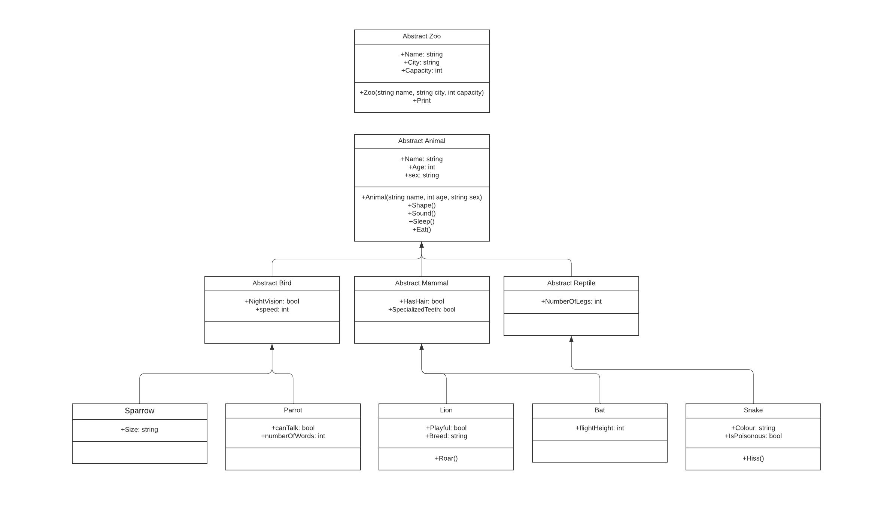
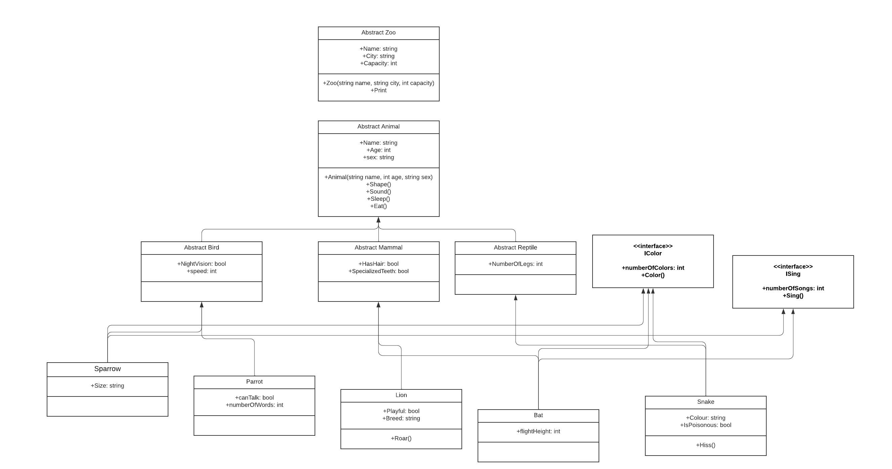

# Lab06-OOP
## What is this project?
A zoo contains animals, and animals can come in many different shapes and sizes. So I created classes and objects to apply the OOP principles using a Zoo example and gave every type unique properties and methods.

---

## UML DIAGRAM PART 1

---
## What are the four OOP principles?
### Inheritance
Inheritance is the procedure in which one class inherits the attributes and methods of another class. We have two key words which are:

Base class: The class that inherits properties from another class is called Sub class or Derived Class.

Derived class: The class whose properties are inherited by sub class is called Base Class or Super class.

### Encapsulation
Encapsulation hides the data from the access of outsiders to make the data secure. So we use it when we want to keep many details private in each class. For example We can create a fully encapsulated class in C# by making all the data members of the class private so that it prevents the data from being accessed by the code outside.

### Polymorphism
Polymorphism means many forms. In OOP it refers to the functions having the same names but carrying different functionalities. We use Polymorphism when we create virtual methods that derived classes could override to create specific behavior.

### Data abstraction
We use data abstraction for hiding the internal details or implementations of a function and showing its functionalities only to make it more simple and easy to use. This is similar to the way you know how to drive a car without knowing the background mechanism. Or you know how to turn on or off a light using a switch but you don’t know what is happening behind the socket.

## OOP principles in my project:

1. Encapsulation: some data are private or only readable so no one can change them.
2. Data abstraction: I used abstract methods in the base class and created for each child it's own version.
3. Polymorphism: I created a method that take an Animal object as argument so the output of this method depends on the children.
4. Inheritance: I have 3 layers of inheritance: grandparent, parent and child classes.

---
# Lab07-OOP
## What is an interface?
Interface is an abstract base class with only abstract members. Interface in C# is a blueprint of a class. It is like abstract class because all the methods which are declared inside the interface are abstract methods. It cannot have method body and cannot be instantiated. It is used to achieve multiple inheritance which can't be achieved by class, so abstraction can also be achieved with interfaces.

---
## My interfaces are:
1. ISing: it has one method which is Sing() and one property which is numberOfSongs, they are implemented in Sparrow and Bat classes, to show the difference between them so each class has it's own version of method and property.
2. IColor: it also has one method which is Color() and one property which is numberOfColors, they are implemented in Sparrow, Snake and Bat classes, so each animal has it's own color description and property.
3. 
**Note:** please check the project to view the examples, I also wrote comments to make it easier to understand.

---

## UML DIAGRAM PART 2

